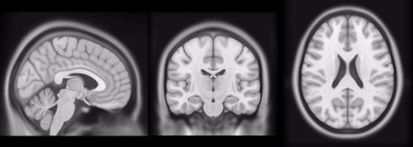

## BrainspriteR

This is an R wrapper for [brainsprite.js](https://github.com/SIMEXP/brainsprite.js).

It is a visualization tool for MRI images. Given a sprite sheet like [this](docs/sprite.jpg), it will create a interactive 3D viewer.

## Installation

```r
devtools::install_github('oganm/brainspriteR)

```

## Usage

```r
brainsprite(sprites = 'sprite.jpg',
            flagCoordinates = TRUE,
            spriteHeight = 233,
            spriteWidth = 189)

```


See [here](https://oganm.github.io/brainspriteR/demo) for an interactive demo.

